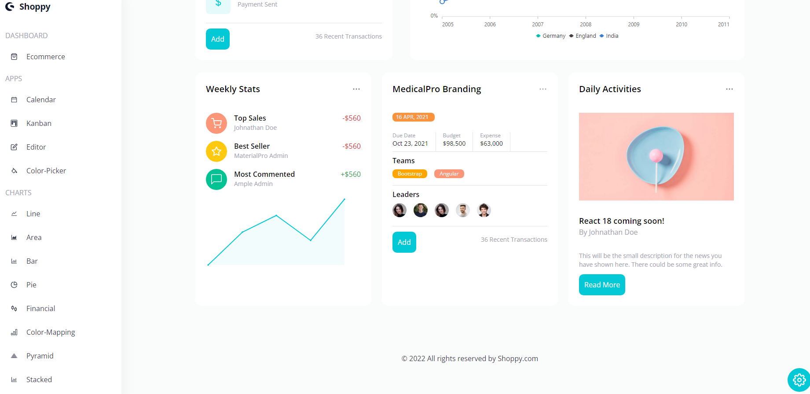
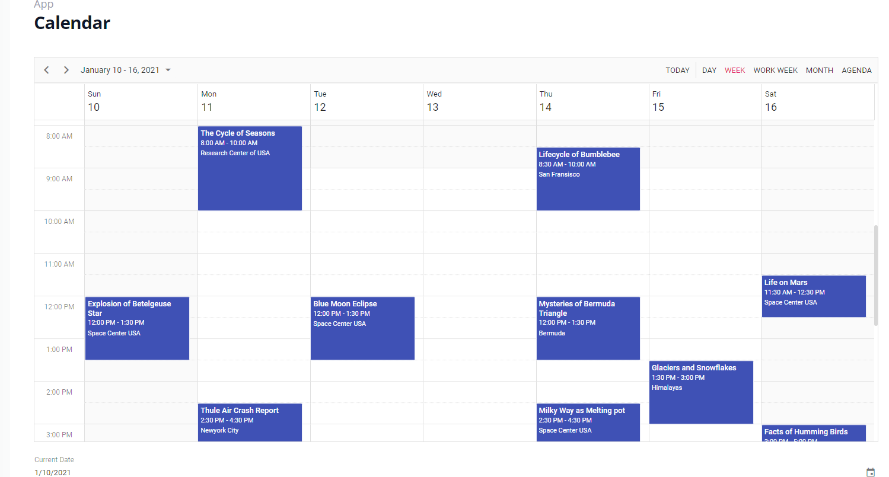
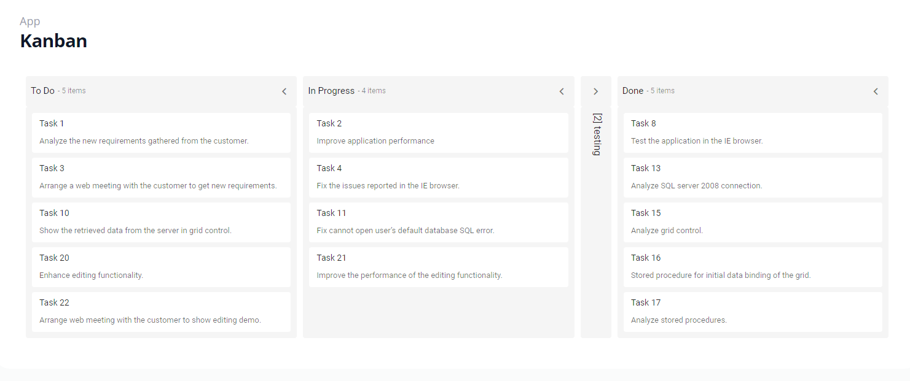
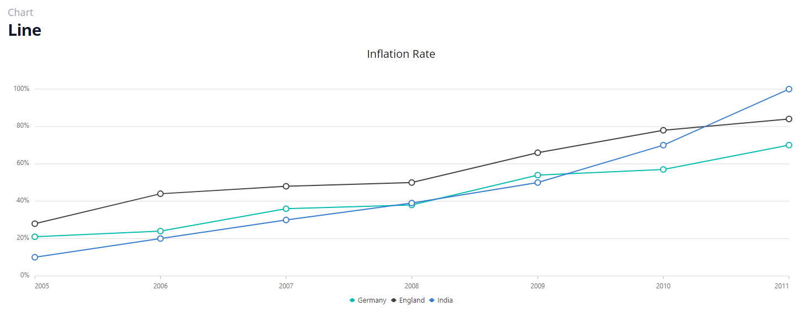
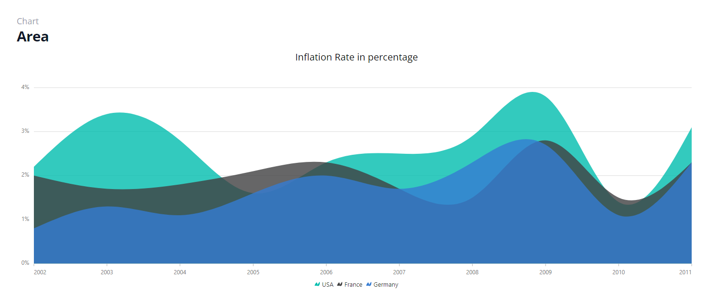
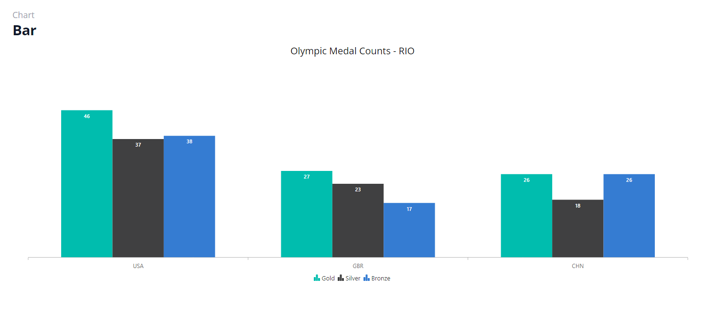
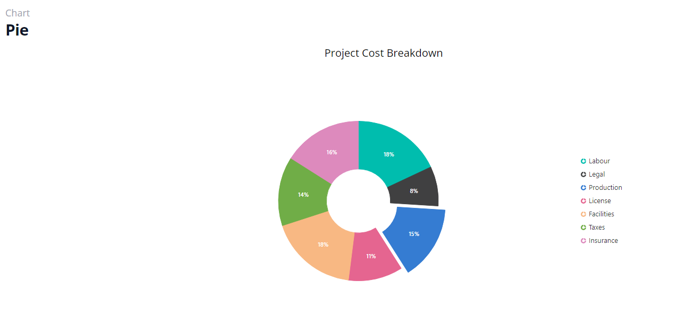
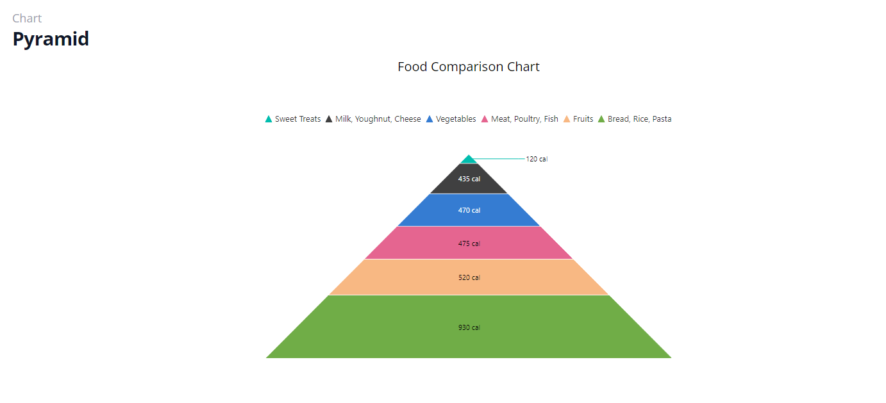

# Build a React Admin Dashboard 

Link: https://project-dashboard-main.vercel.app/



## Installation:

```bash
Clone the repository: `git clone https://github.com/JimmyFu-Coder/project_dashboard`
Navigate to the project directory: `cd project_dashboard`
Install dependencies: `npm install`
```

## Usage:

To start the development server, run the following command:
```bath
npm start
```

## Features:

1. Calendar
   
2. Kanban
   
3. CHARTS
   1. Line
        
   2. Area
        
   3. Bar
    
   4. Pie
    
   5. Pyramid
    
   6. ...